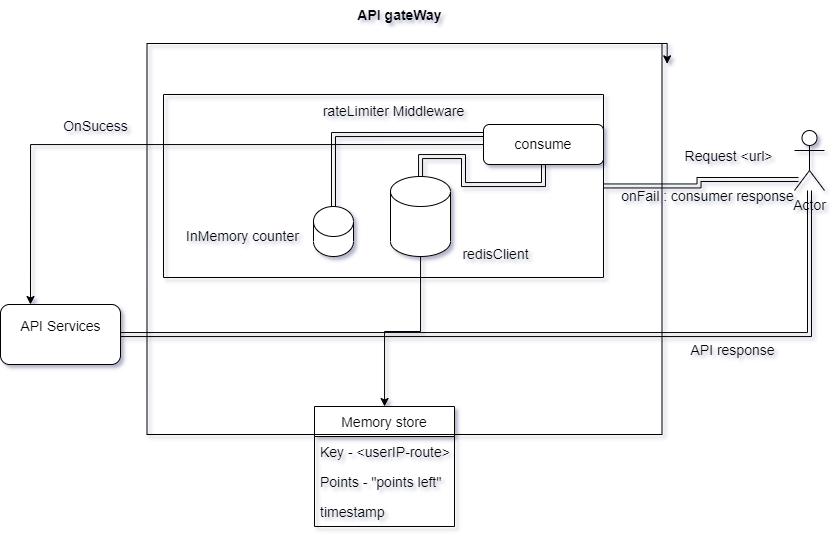

# Rate Limitor

### This Application is the working prototype of "How can we implement API throtteling to prevent DDOS". In order to showcase API throtteling, an external public API service is integrated here and all the requests are being made to pass throuh the rateLimiter middleware which allows 20 request per second to each of the API.

## Installation steps

1. Clone the git repo
2. run the command "npm install"
3. test the service on PORT 8000
4. test the code using "npm run test"

## Packages and tools used

- express - Server is created here using express framework
- rate-limiter-flexible - This is a third party library which provides the underlining functionaliy to implement rate limiting.
- ava - Test cases are written in ava
- ioredis - The choice of database store which works with "rate-limiter-flexible" to ensure API throtteling.
- axios - To make API request to 3rd party service
- jsonPlaceholder - jsonPlaceholder provides some publicaly exposed API to work on fake data



## Description

### rateLimiter middleware uses the fixed window strategy to check on the limits of the API. Since this middleware sits globally for the entire application using `express.use()`, thus all the APIs are subjected to throtelling. Below are steps that goes into action when a request is being made

- The actor(User) makes a request to our endpoint exposed by API gateway
- The request is intercepted by the rateLimiter and a decision is being made based on available points the user have i.e if the user is eligible to make a successful API request(implementation details provided below)
- If the user is eligible for making a call,the current request point is decrement by 1 and request goes to the API and the data is shared
- else User is notified with the throttled message and user is made to wait for the 1 second to pass to make another 20 calls to the API

## How the rateLimiter is working

rateLimiter is using the functionality provided by rate-limiter-flexible module that counts and limits number of actions by key and protects the API/Server from DDoS and brute force attacks at any scale. We can choose any database of our choice for the store management of our keys and corresponding counts.
This application is using redis as one such choice as it is fast and simpler to embed.

Below is the code that describes how our memory is configured in the store.

```js
const rateLimiterMemory = new RateLimiterMemory({
	points: 5, // 20/5 If there are 4 instances
	duration: 1, // in 1 second
});

const rateLimiter = new RateLimiterRedis({
	storeClient: redisClient,
	points: 20, // 20 request can be made
	duration: 1, // in 1 second
	inmemoryBlockOnConsumed: 20, // If the user(Id/IP) consume >= 20 points per second
	insuranceLimiter: rateLimiterMemory, // Insurance strategy if the redis server is down
});
```

The role of `RateLimiterRedis` is to create a redis memory that will manage the limit in current process and it will internally expires keys by `setTimeout`. We are using `RateLimiterRedis` instead of `RateLimiterMemory` to provide some insurance for the edge case when the database is not respoding. Our storeClient is redis(it can be anything like mongo,mySQL etc). We are providing 20 points to a user for a particular endpoint in 1 second duration. `inmemoryBlockOnConsumed` holds the details of the current point available for the key associated with the user. When the user consumes all his point, a subsequent request to the store can be prevented based on `inmemoryBlockOnConsumed`. We are also using `insuranceLimiter` for the case where the database is down due to some reason. Thus, as an insurance we can distribute equal points to each instance of the distributed system for a given duration(Here assuming we have 4 instances, we can distribute 5 points to each instance for 1 second. Check `rateLimiterMemory`)

```js
import rateLimiter from '../service/rateLimiterService.js';
import {ThrottleError} from '../error/errors.js';
const rateLimiterMiddleware = (req, res, next) => {
	const key = `${req.ip}-${req.url}`; // Any values can be a key Ex:(userId, authorizationToken).Currently each individual API is subject to rate-limiting i.e if the MAX API request is 20 per sec, all the API can be called 20 times in a second. This behaviour can be prevented with the choice of key.
	const pointsToConsume = 1; // A conditional logic can sit here and decide the points to leak
	rateLimiter
		.consume(key, pointsToConsume)
		.then(() => {
			next();
		})
		.catch(() => {
			res.status(429).send(new ThrottleError());
		});
};
```

`rateLimiterMiddleware` is intercepting all the request incoming to the API gateway. Upon recieving any request a key is created(If already present, a lookup will happen). Here our current key is "reqIP-urlPath" but it can be any unqiue identifier of the client. `pointsToConsume` is the number of points that neeed to be deducted from our `points` value stored in the memory(See `rateLimiter`). The role of consume API is to validate the request. It checks internally if the requested point can be deducted from the store. Based on the promise state(resolved or rejected) the handler decides if the request to be passed to the concern API. Upon resolved, the request goes to the targeted API else throttle error is shared with the user. In later case, the request will be blocked for the given duration(here 1 second).

## Conclusion

The above implemenatation can provide a standard solution toward the DDoS or brute force attack. Since it is using fixed window strategy, it is faster than other strategy like rolling window where server may need to work extra to keep checking the logs. Since not all application can be designed in way that will be 100% secure so there is always a chance of improvement. I believe there can be improvement here also and strategy like Token bucket can be used. A concept of pagination can also be a helpful improvement as it can restrict the volume of data that needs to travel across internet.
